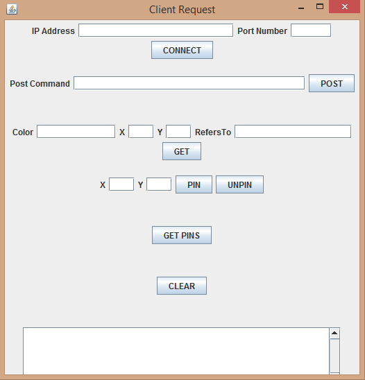
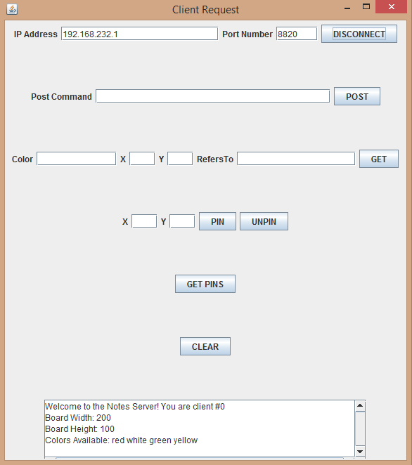
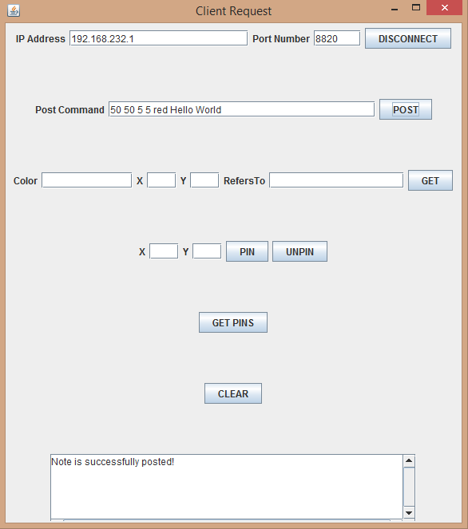
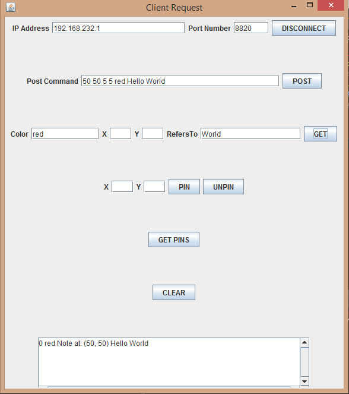
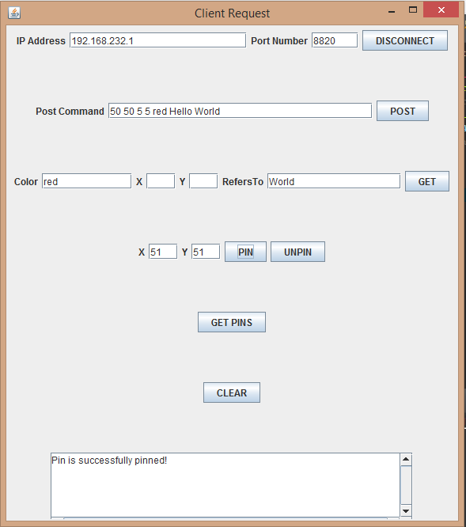
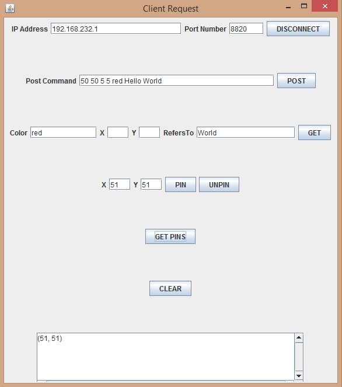

## Message Board Simulator
A program simulating that of a bulletin board where users are able to post notes and remove them freely from the board. This application was programmed alongside another programmer, Yiling Pang, using Java as our choice of language. This application implements a Server and Client based Virtual Message Board by utilizing the StreamSocket API provided by Java. This application allows for clients to store "notes" on a server, and to request "notes" that have certain properties. 

To further visualize the application, consider a physical bulletin board found in an office. Notes with various messages can be pinned all around the the space of the bulletin board (even on top of each other) and then removed from the same board. Each message is written on its own note and then pinned onto the board. Each pin occupies occupies a space on the board and cannot occupy the space of another pin. In the case of when a pin for a note is requested to occupy a space of another pin, the pin that was already there will be used to pin both notes. Notes on the other hand can occupy the same space and have the option of using the same pin as the other note, or another pin with the pin already being used (This would mean the note will have two pins on it). Notes vary in message it contains, location on board, and the colour of the note. 

This application allows for one server (bulletin board) to connect with multiple clients (users). 

The requirements for the Client and Server are as follows:

The Client must:

 - Request a connection with the server 
 - Send different types of messages through an established connection (Terminology of the following is further explained in the rfc document for this application):
	 - 1. POST  
	 - 2. GET 
	 - 3. PIN/UNPIN
	 - 4. CLEAR
	 - 5. DISCONNECT 

The Server must:

- Accept multiple client connections 
- Maintain appropriate data structure to hold data received from client 
- Process messages received from client
	- 1. If message is POST, server will store the note sent by the Client 
	- 2. If message is GET, server must send to the client all notes currently stored that fit the request 
	- 3. If message is PIN, server must pin all relevant notes 
	- 4. If message is UNPIN, server must unpin all relevant notes 
	- 5. If message is CLEAR, server must erase all notes which are unpinned  
	- 6. If message is DISCONNECT, server will disconnect from the requesting client 
### Client Specifications
The Client is presented as a GUI where users can input their requests to post notes, remove them, or get existing notes from the server. 

The Client GUI consists of the following fields:

 - Text field to provide IP address of the Server 
 - Text field to provide Port number 
 - Connect/Disconnect Button 
 - Text field to provide text to sent to the server in form: {x-coordinate} {y-coordinate} {width} {height} {colour} {message}
 - A POST button to post the note to server board 
 - Text fields to provide specifications for GET request (Colour, X-Coordinate, Y-Coordinate, RefersTo)
 - A GET button to send a GET request to Server 
 - Text fields to provide a location to place a pin on the board (X-Coordinate, Y-Coordinate)
 - A PIN and UNPIN button to place or remove pins on Server board 
 - A GET PINS button to get all locations of existing pins 
 - A CLEAR button to remove notes that are unpinned 
 - Text field to display result of request

### Server Specifications
The Server is a multithreaded Java application that has multiple command line arguments and starts with an empty dictionary of "notes". The arguments are as follows: 

{Port Number}, {Board Width}, {Board Height}, {Default Colour}, {Colour 2}, ..., {Colour n}

An example command line that is executable would be: ">java Server 4554 200 150 yellow red green blue" 

The above command will accept connections on Port number 4554, supporting the board of 200 units wide and 150 units tall, and accepting notes of colours yellow, red, green and blue (with yellow being the default colour if Client did not specify a colour). 

Every new Client that is connected to the Server will receive a list of available colours to post notes with and the dimension of the board. The Client then has to make sure that requests from Client side satisfies the given parameters (For details on error handling, please refer to RFC document). 

### Sample Results
#### Initial connection 

Upon initial connection, the Server provides the Client with its Client number, the board width, height, and available note colours.

#### POST example 

The above shows a POST sample, providing the Server with the command "POST 50 50 5 5 red Hello World". This command tells the Server that the note is to be placed at location (50, 50) on the board, with the note size being 5 units wide and 5 units tall, the colour of the note being red and its message being "Hello World". If the POST request satisfies Server conditions, the text field at the bottom will provide the Client with a success message. 

#### GET Example

The above shows a GET sample, providing the Server with the command "GET colour=red refersTo=World". This command tells the Server that the Client is requesting a note that is red and contains the sub-string "World" in its message. The resultant note will be provided to the Client in its bottom text field. 

#### PIN Example 

The above shows a PIN sample, providing the Server with the command "PIN 51 51". This command will tell the server to place a pin at location (51, 51) on the board. Any notes that fall in that location will have its status as pinned.

#### GETPINS Example 

The above shows a GETPINS sample, sending a request to the server to provide the Client with the location of all the existing pins on the board. 

 
